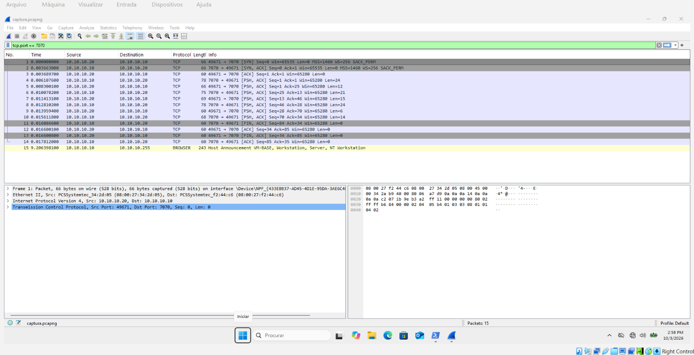

# Relatório — Fase 1: Reconhecimento e Escuta Passiva

**Disciplina:** Laboratório de Redes de Computadores — PUCRS
**Trabalho:** Interceptação e Defesa de um Protocolo de Aplicação
**Fase:** 1 — Criação da aplicação alvo e do sniffer de tráfego (T1)

> **[PREENCHER — identificação do grupo]**
> - **Integrantes:** [nome 1], [nome 2], [nome 3]
> - **Data da entrega:** [__/__/2026]

---

## 1. Objetivo

Demonstrar, na prática, a **quebra de confidencialidade** de um protocolo de
aplicação que trafega em texto claro. Para isso o grupo montou um par
cliente-servidor próprio (protocolo **SLAP**) dentro de uma rede virtual isolada
e implementou um **interceptador passivo (sniffer) com socket raw**, capaz de ler
as credenciais trocadas entre duas máquinas sem participar da conexão.

## 2. Topologia da rede

Três VMs VirtualBox em uma **rede interna isolada** (`labredes`, sem saída para a
internet), com **modo promíscuo "Permitir Tudo"** habilitado para que a
VM-observador enxergue o tráfego entre as outras duas.

```
                 Rede Interna VirtualBox "labredes" (promíscuo: Permitir Tudo)
                 ┌─────────────────────────────────────────────────┐
 VM-cliente      │                                                 │      VM-servidor
 10.10.10.20 ────┼────────────────── switch virtual ────────────────┼──── 10.10.10.10:7070
                 │                        │                        │
                 │                 VM-observador                   │
                 │                 10.10.10.30                     │
                 └─────────────────────────────────────────────────┘
```

| Papel | VM | IP | Função |
|---|---|---|---|
| Servidor | VM-servidor | `10.10.10.10:7070` | Executa `servidor.py` |
| Cliente | VM-cliente | `10.10.10.20` | Executa `cliente.py` |
| Observador | VM-observador | `10.10.10.30` | Executa `sniffer.py` (socket raw) + Wireshark |

Detalhes de montagem da rede e das VMs estão no `README.md`.

## 3. O protocolo alvo — SLAP (Simple Login Access Protocol)

Protocolo de login próprio, em **texto ASCII**, uma linha por mensagem terminada
em `\r\n`, inspirado no fluxo de autenticação do FTP (códigos `220`/`331`/`230`/
`530`/`221`) para ficar legível e reconhecível na captura. As credenciais viajam
**em texto claro por design** — é exatamente a fragilidade que esta fase
demonstra e que a Fase 3 vai eliminar com TLS + hash.

```
Servidor                          Cliente
   |--- 220 slap-server pronto ---->|
   |<-------- USER <usuario> -------|
   |--- 331 senha requerida ------->|
   |<-------- PASS <senha> ---------|
   |--- 230 login bem-sucedido ---->|   (ou 530 usuario ou senha invalidos)
   |<-------- QUIT ------------------|
   |--- 221 ate mais --------------->|
```

## 4. Ambiente e execução

- **Linguagem:** Python 3 (sockets usados diretamente, sem frameworks que
  escondam o socket, conforme requisito).
- **Serviço alvo:** `servidor/servidor.py` (TCP, multi-thread) e `cliente/cliente.py`.
- **Interceptador passivo:** `observador/sniffer.py` — socket raw com `SIO_RCVALL`
  (Windows), lê o cabeçalho IP/TCP manualmente e extrai o payload da porta 7070.

Comandos de execução (resumidos; versão completa no `README.md`):

```
# VM-servidor
python servidor\servidor.py

# VM-observador (PowerShell como Administrador; firewall do Windows desligado)
python observador\sniffer.py 10.10.10.30

# VM-cliente
python cliente\cliente.py 10.10.10.10 7070 aluno senha123
```

> **Observação técnica relevante:** o sniffer de socket raw só captura o tráfego
> alheio com o **Firewall do Windows desligado** na VM-observador. Com ele ligado,
> o Defender descarta os pacotes antes de chegarem ao socket raw (sintoma: o
> sniffer sobe mas não exibe nenhuma linha). Como a rede é isolada, desligar o
> firewall é seguro neste laboratório.

## 5. Como o interceptador passivo funciona

O `sniffer.py`:
1. Abre um **socket raw** (`AF_INET`, `SOCK_RAW`, `IPPROTO_IP`) ligado à interface
   da VM-observador (`10.10.10.30`).
2. Ativa o modo de captura total com `ioctl(SIO_RCVALL, RCVALL_ON)` — passa a
   receber **todos os pacotes IP** que passam pela interface, inclusive os
   destinados a outras máquinas (graças ao modo promíscuo da rede virtual).
3. Para cada pacote: interpreta o **cabeçalho IP** (protocolo, origem, destino) e,
   se for TCP, o **cabeçalho TCP** (portas), calculando o deslocamento do payload.
4. Filtra pela **porta 7070** e, ao encontrar `USER`/`PASS`, destaca como
   **credencial capturada**.

Nenhum dado é alterado — é uma escuta **estritamente passiva**.

## 6. Evidências de captura

### 6.1 Saídas da execução (serviço alvo)

**Servidor (VM-servidor):**

```
[14:09:38] Servidor SLAP escutando em 10.10.10.10:7070
[14:11:33] Conexao aberta por 10.10.10.20:49673
[14:11:34] Login OK: usuario='aluno' de 10.10.10.20
[14:11:34] Conexao fechada com 10.10.10.20:49673
```

**Cliente (VM-cliente):** (o cliente mascara a própria senha na tela com `*`; a
senha real, porém, trafega em claro na rede — ver seções 6.2 e 6.3)

```
< 220 slap-server pronto
> USER aluno
< 331 senha requerida
> PASS ********
< 230 login bem-sucedido
< 221 ate mais
```

### 6.2 Interceptador passivo (sniffer próprio de socket raw)

A VM-observador (`10.10.10.30`), **sem participar da conexão**, leu usuário e senha
de uma conversa entre `10.10.10.20` e `10.10.10.10`:

```
[14:10:36] Sniffer ativo em 10.10.10.30, observando a porta 7070...
[0001 14:11:30] 10.10.10.20:49673 -> 10.10.10.10:7070  *** CREDENCIAL CAPTURADA *** 'USER aluno'
[0002 14:12:43] 10.10.10.20:49673 -> 10.10.10.10:7070  *** CREDENCIAL CAPTURADA *** 'PASS senha123'
[0003 14:12:43] 10.10.10.20:49673 -> 10.10.10.10:7070  'QUIT'
```

Este é o requisito central da fase: o **sniffer próprio**, implementado com socket
raw (sem bibliotecas que escondam o socket), extraiu as credenciais `aluno` /
`senha123` em texto claro.

### 6.3 Evidência com Wireshark (números dos pacotes)

Captura feita na VM-observador com o filtro `tcp.port == 7070`.
Arquivo bruto: `evidencias/captura_slap.pcapng`.



Pacote a pacote, a troca SLAP completa trafega **legível**:

| Nº do pacote | Origem → Destino | Conteúdo em texto claro |
|---|---|---|
| 4 | 10.10.10.10 → 10.10.10.20 | `220 slap-server pronto` |
| 5 | 10.10.10.20 → 10.10.10.10 | `USER aluno` |
| 6 | 10.10.10.10 → 10.10.10.20 | `331 senha requerida` |
| 7 | 10.10.10.20 → 10.10.10.10 | `PASS senha123` |
| 8 | 10.10.10.10 → 10.10.10.20 | `230 login bem-sucedido` |
| 9 | 10.10.10.20 → 10.10.10.10 | `QUIT` |
| 10 | 10.10.10.10 → 10.10.10.20 | `221 ate mais` |

Os pacotes **5** (`USER aluno`) e **7** (`PASS senha123`) são a prova direta da
exposição das credenciais. O conteúdo foi confirmado inspecionando o payload TCP
de cada pacote (no Wireshark, `Transmission Control Protocol → TCP payload`, ou o
painel de bytes).

> *Nota:* a captura do sniffer (6.2) e a do Wireshark (6.3) são de execuções
> distintas do mesmo cenário — por isso a porta efêmera do cliente difere
> (`49673` vs `49671`). Ambas demonstram o mesmo fato: as credenciais trafegam em
> texto claro.

> **[OPCIONAL — melhoria de evidência]**
> Se quiserem reforçar, adicionar em `evidencias/` um print do **Follow TCP Stream**
> (botão direito num pacote → Follow → TCP Stream) e referenciá-lo aqui. A tabela
> acima já atende ao requisito de "evidência com número dos pacotes".

## 7. Análise — quebra de confidencialidade

A captura comprova que **qualquer host na mesma rede**, sem participar da conexão
e sem nenhuma credencial, consegue ler **usuário e senha em texto claro**. Dois
fatores tornam a escuta possível:

1. **Modo promíscuo da rede virtual:** faz a placa da VM-observador receber também
   os quadros destinados a outras máquinas, não só os endereçados a ela.
2. **Socket raw com `SIO_RCVALL`:** entrega ao programa todos os pacotes IP que
   chegam à interface, permitindo reconstruir o payload da aplicação.

Como o protocolo SLAP não aplica **nenhuma cifragem**, o payload capturado é
diretamente o texto das mensagens. O sniffer próprio e o Wireshark leem exatamente
o mesmo conteúdo, confirmando o resultado por dois caminhos independentes. Note
ainda que a máscara de senha exibida pelo cliente (`PASS ********`) é puramente
cosmética: na rede, a senha real (`senha123`) aparece integralmente (pacote 7).

Caso o protocolo carregasse outros dados sensíveis (tokens, mensagens, comandos,
valores), todos estariam igualmente expostos. Esta fragilidade motiva a defesa da
**Fase 3**: ao encapsular o canal em **TLS**, este mesmo payload passaria a
trafegar cifrado e o sniffer veria apenas bytes ilegíveis.

## 8. Conclusão

A Fase 1 cumpriu seu objetivo: com um serviço alvo próprio (SLAP) e um
interceptador passivo de socket raw, o grupo demonstrou — por evidência do sniffer
próprio **e** do Wireshark (pacotes 5 e 7) — que credenciais trafegam em **texto
claro** na rede, caracterizando a **quebra de confidencialidade**. Esse resultado
estabelece a linha de base "antes" que será comparada com a versão protegida na
Fase 3, quando a mesma captura deverá se tornar ilegível.

## Anexos

- `evidencias/captura_slap.pcapng` — captura bruta do Wireshark.
- `evidencias/print_wireshark.png` — lista de pacotes (filtro `tcp.port == 7070`).
- Código-fonte: `servidor/`, `cliente/`, `observador/`.
